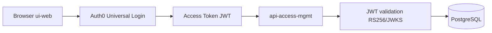

# auth0-access-request-portal

Access Request Portal is a TypeScript monorepo with:

- ui-web: React frontend for creating and managing access requests
- api-access-mgmt: Express API with PostgreSQL persistence

This repository now includes Phase 2 Auth0 integration.

## Phase 2 Overview

Phase 2 adds authentication and per-user data isolation using Auth0:

- Browser users sign up, log in, and log out through Auth0 Universal Login.
- Frontend requests include an access token in the Authorization header.
- Backend validates JWTs (issuer, audience, signature) using RS256/JWKS.
- Access requests are scoped to the authenticated Auth0 user id.

### Simple Auth Flow

## Auth0 Setup Summary

Configured Auth0 resources:

- Tenant: kodez-access-portal (AU)
- Custom API audience: https://api.access-portal.local
- Application: Access Portal Web (Single Page Application)
- Application: Access Portal API (Regular Web Application)
- Allowed Callback URL: http://localhost:5173
- Allowed Logout URL: http://localhost:5173
- Allowed Web Origin: http://localhost:5173
- User-delegated access from Access Portal Web to Access Portal API is granted

Notes:

- Do not store or commit secrets in this repository.
- Do not expose backend client secrets in frontend code.

## Environment Variables

Do not commit real .env files. Copy from .env.example and set values locally.

### api-access-mgmt (.env)

- PORT=<port>
- NODE_ENV=<development|test|production>
- DATABASE_URL=<postgresql-connection-string>
- CORS_ORIGIN=<frontend-origin>
- AUTH0_DOMAIN=<your-auth0-domain>
- AUTH0_AUDIENCE=<your-auth0-audience>
- AUTH0_CLIENT_ID=<your-api-app-client-id>
- AUTH0_CLIENT_SECRET=<your-api-app-client-secret>

### ui-web (.env)

- VITE_API_BASE_URL=<backend-base-url>
- VITE_AUTH0_DOMAIN=<your-auth0-domain>
- VITE_AUTH0_CLIENT_ID=<your-spa-client-id>
- VITE_AUTH0_AUDIENCE=<your-auth0-audience>

## Create a Test User

1. Start the frontend and open http://localhost:5173.
2. On the landing page, click Sign up.
3. Complete Auth0 Universal Login sign-up.
4. After sign-up/login, you are redirected to /dashboard.

## Updated Demo Flow (Phase 2)

1. Start PostgreSQL and backend, then start ui-web.
2. Open http://localhost:5173 and sign up from the landing page.
3. After redirect to /dashboard, create an access request.
4. In DBeaver, confirm the row has auth0_user_id matching the authenticated user sub.
5. Open a private browser window, create/sign in as a second user, and verify only that user's own requests are visible.
6. Call API without a token:
   - curl http://localhost:4000/api/access-requests
   - Expected result: 401 Unauthorized.
7. Log out and confirm /dashboard is no longer accessible without authentication.

## Security Notes

- Uses Authorization Code Flow with PKCE for SPA authentication.
- Backend validates JWTs using RS256 signature verification and JWKS key discovery.
- API data access is scoped by authenticated user id for per-user isolation.
- Update/delete on foreign rows return 404 to avoid leaking record existence.
- Tokens are not stored in localStorage.

## Tech Stack

Frontend (ui-web):

- React + Vite
- TypeScript
- Tailwind CSS
- TanStack Query
- React Router
- Axios
- Auth0 React SDK

Backend (api-access-mgmt):

- Node.js + Express
- TypeScript
- PostgreSQL + pg
- Zod
- cors, helmet, dotenv
- pino + pino-http
- express-oauth2-jwt-bearer

Infrastructure:

- Docker + Docker Compose
- PostgreSQL 16

## Main Endpoints

- GET /health (public)
- GET /api/access-requests (protected)
- POST /api/access-requests (protected)
- PATCH /api/access-requests/:id (protected, owner scoped)
- DELETE /api/access-requests/:id (protected, owner scoped)

## Phase 3 Ideas

- Admin role via Auth0 RBAC for cross-user approval/review workflows.
- Custom email claim in access tokens via Auth0 Action.
- Google social login via Auth0.
